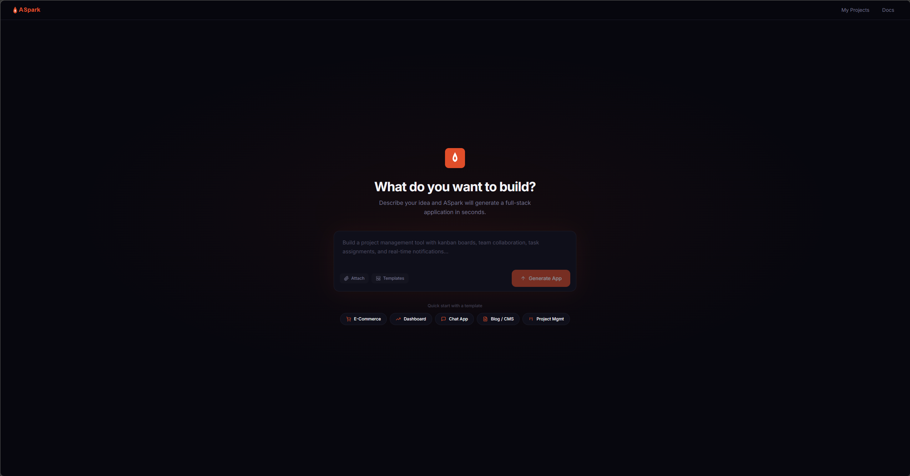
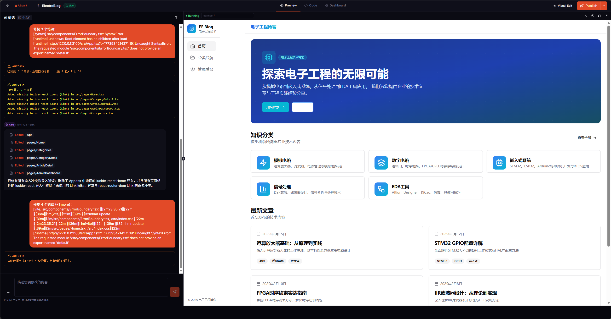
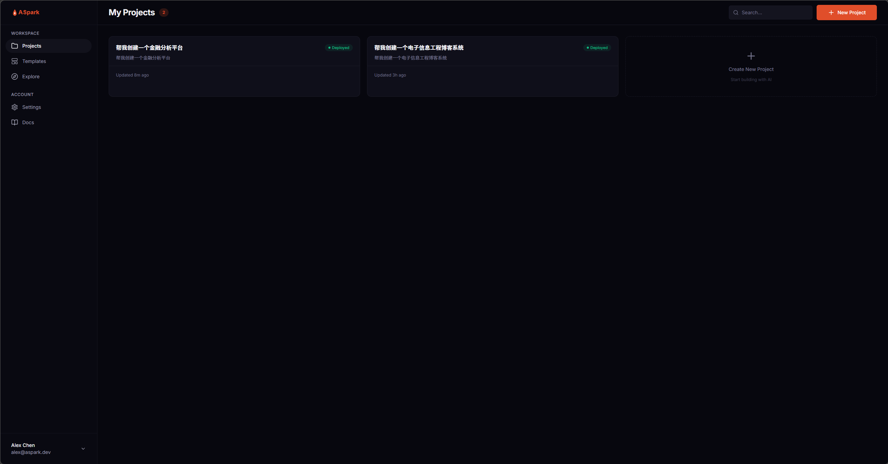

<p align="center">
  
</p>

<h3 align="center">From Idea to App, in One Sentence.</h3>

<p align="center">
  An open-source, AI-powered full-stack application generator.<br/>
  Describe what you want in plain language — ASpark builds the entire app for you.
</p>

<p align="center">
  <a href="#features">Features</a> •
  <a href="#architecture">Architecture</a> •
  <a href="#getting-started">Getting Started</a> •
  <a href="#roadmap">Roadmap</a> •
  <a href="#contributing">Contributing</a> •
  <a href="#license">License</a>
</p>

---

## What is ASpark?

ASpark is an open-source AI application generator that lets you go **from idea to production app in minutes**. Describe your requirements in plain language, and ASpark handles everything — requirement analysis, architecture design, full-stack code generation, real-time preview, and one-click deployment.

No boilerplate. No manual setup. One sentence in, a complete application out.

- **One-click app delivery** — Type a prompt, get a fully functional web application with frontend, backend, and database
- **Smart planning** — AI clarifies your requirements through interactive Q&A before writing any code, ensuring the output matches your intent
- **Multi-model intelligence** — Automatically routes each task to the best-suited LLM for optimal results
- **Full code ownership** — Generated apps are standard, portable projects with zero vendor lock-in

<p align="center">
  
</p>

## Features

### AI Code Generation
- Generate complete full-stack projects (React + Vite frontend, Supabase backend) from a single prompt
- Streaming code output with real-time progress tracking
- Incremental iteration — refine your app through conversation, not from scratch
- Built-in code parser supporting XML and Markdown code block formats from LLM output

### Plan Mode — Think Before Building
- AI asks clarifying questions before writing a single line of code
- Generates a structured plan (target users, core flows, entities, pages, tech requirements)
- Review, revise, and approve the plan before generation begins
- Persistent sessions — close the browser and resume where you left off

### Multi-Model LLM Router
- Automatically selects the best model for each task:

  | Task | Model |
  |------|-------|
  | Scaffold (first-time generation) | GPT-5.3 Codex |
  | Iteration | Kimi K2.5 |
  | Code completion | Doubao Flash |
  | Refactoring | GPT-5.3 Codex |
  | Complex reasoning | DeepSeek Reasoner |
  | General | DeepSeek Chat |

- Easily extensible — add new providers by implementing a simple adapter

### Web IDE
- Full Monaco Editor with syntax highlighting, file tree navigation, and inline editing
- Three-panel workspace: **Chat** | **Preview** | **Code**
- File version history with one-click rollback
- Suggestion chips for guided next steps

<p align="center">
  
</p>

### Live Preview with HMR
- Embedded Vite dev server with hot module replacement
- See your app update in real-time as AI generates code
- Background building — generation continues even if you navigate away

### Auto-Fix
- Detects runtime errors in the preview automatically
- Attempts up to 3 AI-powered fix cycles without user intervention
- Falls back to human-readable suggestions when auto-fix fails

### One-Click Deploy & Export
- Deploy directly to Vercel with a single click
- Download the entire project as a ZIP file
- Generated apps are standard Next.js projects — run them anywhere

### Database Integration
- Deep Supabase integration with auto-generated schemas
- Row-Level Security (RLS) policies generated automatically
- Auth and data service templates pre-configured

<p align="center">
  
</p>

## Architecture

ASpark is built as a **Turborepo monorepo** with pnpm workspaces.

```
ASpark/
├── apps/
│   ├── web/                          # Main platform (Next.js 14)
│   │   ├── app/                      # App Router pages & API routes
│   │   │   ├── (dashboard)/          # Dashboard & IDE workspace
│   │   │   └── api/                  # 25 API endpoints
│   │   ├── components/
│   │   │   ├── editor/               # ChatPanel, FileTree, CodeViewer, PreviewFrame, etc.
│   │   │   └── ui/                   # shadcn/ui base components
│   │   ├── hooks/                    # useGeneration, usePlan, useAutoFix
│   │   ├── lib/
│   │   │   ├── llm/                  # Multi-model router
│   │   │   ├── code-gen/             # Parser, validator, file merger, auto-fixer
│   │   │   ├── preview/              # Vite dev server process manager
│   │   │   ├── prompts/              # System prompts, plan prompts, fix prompts
│   │   │   ├── build/                # Build job tracker
│   │   │   ├── deploy/               # Vercel deployment
│   │   │   ├── db/                   # Schema execution
│   │   │   ├── agents/               # AI agent runner
│   │   │   ├── automations/          # Workflow automation engine
│   │   │   └── templates/            # 40+ template files (config, infra, shadcn components)
│   │   ├── store/                    # Zustand (editorStore, projectStore)
│   │   └── types/
│   └── promo-video/                  # Promotional video (Remotion)
├── packages/
│   ├── shared-types/                 # Cross-package TypeScript types
│   └── generated-app-template/       # Scaffold template for generated apps
├── supabase/
│   └── migrations/                   # 9 SQL migration files
├── scripts/                          # Database migration runners
├── turbo.json                        # Turborepo pipeline config
└── pnpm-workspace.yaml
```

### Tech Stack

| Layer | Technology |
|-------|-----------|
| **Framework** | Next.js 14.2 (App Router), React 18 |
| **Styling** | Tailwind CSS 3.4, Radix UI, shadcn/ui |
| **State** | Zustand 5.0 |
| **Code Editor** | Monaco Editor |
| **AI/LLM** | Vercel AI SDK, DeepSeek, Moonshot (Kimi), OpenAI, Google, Doubao |
| **Database** | Supabase (PostgreSQL), Row-Level Security |
| **Deployment** | Vercel SDK |
| **Build Tool** | Turborepo, pnpm |
| **Language** | TypeScript 5.7 (strict mode) |

### API Endpoints

ASpark exposes 25 API routes covering the full application lifecycle:

| Category | Endpoints |
|----------|-----------|
| **Projects** | CRUD operations, settings |
| **Generation** | Streaming code generation with type-based model routing |
| **Plan Mode** | Questions, plan generation, approval, session management |
| **Preview** | Start/stop dev server, health check, file updates |
| **Deployment** | One-click Vercel deploy |
| **Files** | List, create/update, version history |
| **Messages** | Chat history persistence |
| **Build** | Active build status, progress polling |
| **Suggestions** | AI-powered improvement recommendations |

### Generation Flow

```
User Prompt
    │
    ▼
┌─────────────────┐
│  Plan Mode      │ ◄── AI asks clarifying questions
│  (optional)     │     User reviews & approves plan
└────────┬────────┘
         │
         ▼
┌─────────────────┐
│  LLM Router     │ ◄── Selects model based on task type
│                 │     (scaffold / iterate / refactor / reason)
└────────┬────────┘
         │
         ▼
┌─────────────────┐
│  Code Generator  │ ◄── Streaming text → Parse → Merge → Validate
│                 │
└────────┬────────┘
         │
         ▼
┌─────────────────┐
│  Preview Server  │ ◄── Write files → Boot Vite → HMR
│                 │
└────────┬────────┘
         │
         ▼
┌─────────────────┐
│  Auto-Fix       │ ◄── Detect errors → AI fix → Retry (up to 3x)
│  (if needed)    │
└────────┬────────┘
         │
         ▼
   Ready to Deploy
```

## Getting Started

### Prerequisites

- [Node.js](https://nodejs.org/) v18 or later
- [pnpm](https://pnpm.io/) v9+
- A [Supabase](https://supabase.com/) project (free tier works)
- API keys for at least one LLM provider (DeepSeek, OpenAI, Moonshot, etc.)

### Installation

```bash
# Clone the repository
git clone https://github.com/your-username/aspark.git
cd aspark

# Install dependencies
pnpm install
```

### Configuration

Create the environment file:

```bash
cp apps/web/.env.example apps/web/.env.local
```

Fill in your credentials in `apps/web/.env.local`:

```env
# Supabase
NEXT_PUBLIC_SUPABASE_URL=https://your-project.supabase.co
NEXT_PUBLIC_SUPABASE_ANON_KEY=your-anon-key
SUPABASE_SERVICE_ROLE_KEY=your-service-role-key

# LLM Providers (add at least one)
DEEPSEEK_API_KEY=your-deepseek-key
OPENAI_API_KEY=your-openai-key
MOONSHOT_API_KEY=your-moonshot-key

# Deployment (optional)
VERCEL_TOKEN=your-vercel-token
```

### Database Setup

```bash
pnpm db:migrate
```

### Start Development Server

```bash
pnpm dev
```

Open [http://localhost:3000](http://localhost:3000) and start building.

## Roadmap

- [ ] **Built-in authentication** — Auto-generate login/register flows with Supabase Auth
- [ ] **Visual editor** — Click-to-edit UI elements directly in the preview
- [ ] **Responsive preview** — Mobile / tablet / desktop viewport switching
- [ ] **Template marketplace** — 50+ categorized starter templates
- [ ] **GitHub integration** — Push generated projects to GitHub repos
- [ ] **Collaboration** — Real-time multi-user editing
- [ ] **Built-in integrations** — Email, file upload, AI calls as first-class functions
- [ ] **Multi-deploy targets** — Netlify, Cloudflare Pages, Docker support
- [ ] **Containerized sandbox** — Isolated preview environments (E2B / WebContainers)
- [ ] **Usage billing** — Credit-based pricing for hosted version

See [PRODUCT.md](docs/PRODUCT.md) for a detailed product overview and comparison with similar platforms.

## Contributing

We welcome contributions of all kinds! Here's how to get started:

1. **Fork** the repository
2. **Create** a feature branch: `git checkout -b feat/my-feature`
3. **Commit** your changes: `git commit -m "feat: add my feature"`
4. **Push** to your fork: `git push origin feat/my-feature`
5. **Open** a Pull Request

### Development Guidelines

- Follow existing code style and TypeScript strict mode
- Use [Conventional Commits](https://www.conventionalcommits.org/) for commit messages
- Add tests for new core logic when possible
- Keep PRs focused — one feature or fix per PR

### Project Structure for Contributors

| Directory | What to look at |
|-----------|----------------|
| `apps/web/lib/llm/` | Adding new LLM providers |
| `apps/web/lib/code-gen/` | Improving code parsing and validation |
| `apps/web/lib/prompts/` | Tuning system prompts |
| `apps/web/lib/templates/` | Adding component templates |
| `apps/web/components/editor/` | UI improvements to the IDE |
| `packages/generated-app-template/` | Modifying the generated app scaffold |

## License

This project is licensed under the [MIT License](LICENSE).

---

<p align="center">
  Built with AI, for builders. <br/>
  If ASpark helps you, give it a star!
</p>
